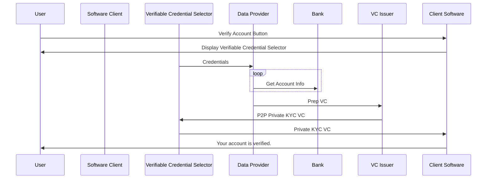
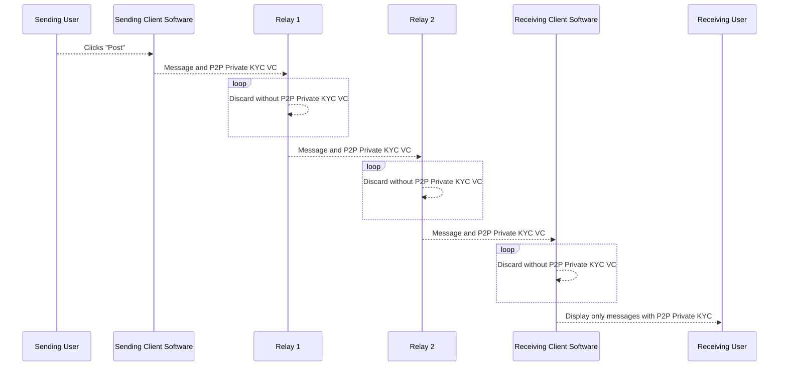
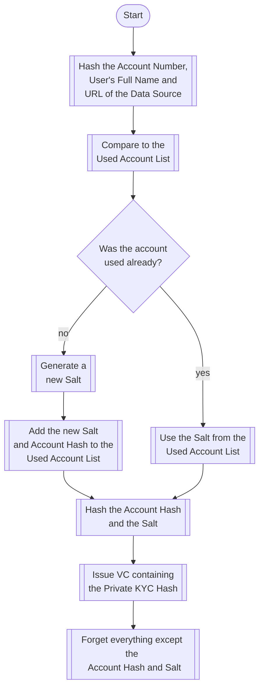
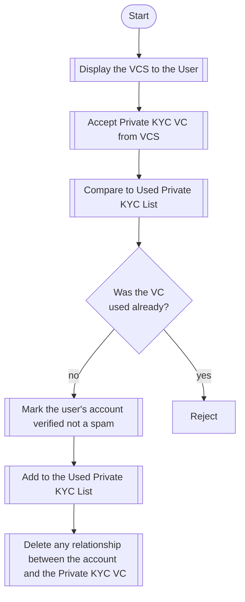

# Using Verifiable Credentials to Kill Spam and Preserve Privacy on Social Media

In the blog Using Verifiable Credentials to Kill Spam and Preserve Privacy on Social Media we introduced the concept of a Private KYC Verifiable Credential that could be used to prove to social media sites that a user is not a spammer without revealing anything else about the user.

Many of the same concepts apply so if you haven't read that blog it's probaly a good idea to do
that and then return to this one. 

In order to accopmlishe the same goals for a decentralized or peer-to-peer social network or messaging service we need to send proof that a sender is not a spammer with every message because there is not a central authority that marks an account "verified." We also need to change how that proof is constructed so that linking the identity of the user to the social media account requires at least two reputable companies to be compromised (as is the case when using Private KYC VCs with centralized social media companies) at the time that the VC is created.

We accomplish this by introducing a P2P Private KYC VC that is generated by seperating the company that issues the VC and the company that verifies account information and by immediately discarding a salt after generating the VC.

## How the P2P Private KYC is Created
After the user clicks the button to verify their account using the software client they use to send messages on the P2P network it presents the Verifiable Credential Selector (VCS). The VCS allows the user to select the bank or utility they would like to login with and provide their username and password. This information is passed to the Data Provider (along with the name of the P2P network) who pulls the account number and name from the Bank and generates an Account Hash (using the name and account number and the name of the P2P network) and then creates a Prep VC that contains the hash of the account number, name and P2P network name and a randomly generated "Prep Salt."

The VCS also encrypts the users P2P network ID with the public key of the VC Issuer so that it can be included in the final VC without the Data Provider being able to associate the social media account to the identity data that it retrievis.

The Data Provider retains a copy of the Account Hash and the Prep Salt so that if the same account is used to request a VC in the future the same Prep Salt will be used and will result in an identical Prep VC. Everything else about the user is forgotten by the Data Provider.

The VC Issuer generates a "P2P Salt" that is hashed with the hash pulled from the Prep VC to create the final P2P Private KYC VC. The P2P Private KYC VC also contains the user's P2P network ID. The P2P Private KYC VC is then passed back to the user's Software Client for use on the P2P network.

The VC Issuer retains the Prep VC and marks it "used." This allows the VC Issuer to only issue one P2P Private KYC VC per bank or utility account. Because the P2P Salt is intentionally forgotten even if the Bank, Data Provider and VC Issuer were compromised it would not be possible to tie the social media account to the identity of the user after the VC is issued.

## How the P2P Private KYC VC is Used
Now that the user has obtain a P2P Private KYC VC that proves he is not a spammer he can include it in every message he sends. If he does engage in spam both the nodes on the network that relay traffic (illustrated with Relay 1 and Relay 2) and the receiving client can ban messages sent with that particular P2P Private KYC VC. If the user is still in good standing messages that accompany 

### How Can This Break?
 
If the Data Provider is compromised he could retain the identity information required to connect the person to the Prep VC, but he would not be able to tie the Prep VC to the user's P2P account without the P2P Salt generated by the VC Issuer.

If the VC Issuer is compromised it does not have the identity information about the user. So it can't associate the P2P accont with the person's identity without the help of the Data Provider.

If the VC Issuer was compromised at the time of issue and retained the P2P Salt, but the Data Provider was compromised later they would not be able to recreate the link between the user's identity and their network ID because they don't have the account information.

If the VC Issuer was compromised at the time of issuer and retained the P2P Salt and the Data Provider was compromised later and the particular bank used was compromised later they would be able to link the identity information with the network ID.

If he Data Provider was compromised at the time of issue and retained the account information and the Prep Salt and the VC Issuer was compromised at a later time the connection between the identity and the network ID could't be established because the P2P Salt is lost.

If both the Data Provider and the VC Issuer were compriomised at the time the VC was issued they could decrypt the user's P2P network ID and match that with the identity information pulled from the Bank.

### How the Private KYC VC is Issued
This flowchart provides an overview of how the Private KYC is issued by the VC issuer after it is provided the
credentials needed directly from the user.

When a user asks to verify their social media account the social media app presents the user with the Verifiable 
Credential Selector. Credentials and other sensitive information is sent directly between the end user and
the VC Issuer so that the social media site is never in possession of any sensitive data.

Once the VC Issuer has issued the Private KYC VC that is shared with the social media company,
but it does not contain anything expect a one-way hash that can't be used to read 
any data and can't even be used to compare data without also obtaining the Salt
that is not shared with the social media company.

The social media company then compares the VC with the list it maintains of previously used VCs.
This list is not tied to any social media account and is only maintained to ensure that a given
VC is only used to verify a single account (not what account it verified).

If the VC was previously used the verification request is rejected, but if it has not been previously used
the VC is added to the list of used VCs and the social media account is marked verified.

At this point the social media company should take special care to ensure it does not keep a record of the VC
used to verify a given account. This ensures that even if all three services suffer a data breach it would 
be impossible to map the real world identity to the social media account used.

For example assume the user used Sophtron as the VC Issuer and selected Boeing Employees Credit Union
as the data source in requesting a verified account.
If a malicious actor obtained the users account number and full name from Boeing Employees Credit Union
he would not be able to match it to the users Verifiable Credential without also obtaining the Salt
stored by MX. And as long as the social media company does not go out of their way to violate
best practices (and contractual obligations) by recording a mapping between the social media account
and the VC used to verify it, the malicious actor would not be able to obtain any additional information
(except that the user did have a verified account at some point on the social media platform). 

## How the Social Media Company Uses the Private KYC Verifiable Credential
This flowchart provides an overview of how the social media company interacts with the user
and processes the VC issued by the VC Issuer.

## Conclusion

Private KYC is a good option to verify users are not spammers that has the lowest cost, least hassle and 
best preserves user privacy for a large subset of potential users. 

The Verifiable Credential Selector (VCS) Block Incubation Project is an open source widget
that makes it easy for a social media sites (or other applications) to integrate with a VC Issuer
that allow users to obtain Private KYC VCs.

For more information on Private KYC and the VCS please reach out on our Forum, or Discord, or open an issue on GitHub.

