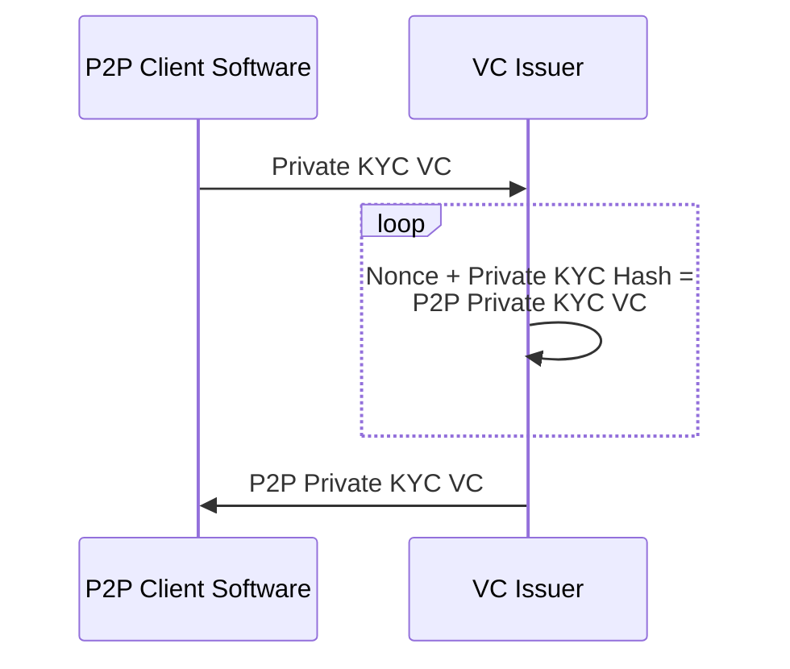
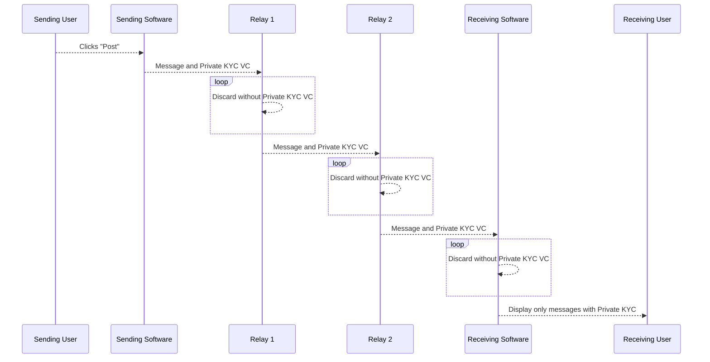

# Dencentralized Private KYC
In Using Verifiable Credentials to Kill Spam and Preserve Privacy on Social Media (link) we showed how using a Private KYC VC with a centralized social media platform could elimante spam while preserving the privacy of the user.

With a Private KYC VC the user's privacy is preserved unless at least two companies are compromised and they must be compromised before the VC is issued. To retain this level of security on a decentralized social media network requires the introduction of an additional VC called the P2P Private KYC VC.

This is because the VC must be passed with every message sent since there is no centralzide social media company that can mark every message associated with a verified account as a verified message. And since the VC is made public an addional layer of security is required.

Fortunately the Private KYC VC process remains unchanged and a Private KYC VC can be used to aquire a P2P Private KYC VC when it is needed. 

To obtain a P2P Private KYC VC the user clicks on "Verify My Account" in the Client Software used to interact with the decentralized social network. The user is then taken through the process to obtain a Private KYC VC using the Verifiable Credential Selector and then the seperate, but automatic, process to obtain a P2P Private KYC VC beigins.

The VCS sends the Private KYC VC to a VC Issuer (not the same VC Issuer that created the Private KYC VC) and requests a P2P Private KYC VC. The VC Issuer then generates a nonce and retrieves the Private KYC Hash from the Private KYC VC and uses both as inputs to a hash function to generate the P2P Private KYC Hash. The VC Issuer then discards the nonce (a randomly generated number). The VC Issuer is also given the screen name or other user identifier for the social media site by the P2P Client Software so that it can be included in the P2P Private KYC VC.

To limit the number of P2P Private KYC VCs that can be issued using the same Private KYC VC, the VC Issuer retains the Private KYC VC and tracks the date when it was used. The VC Issuer will not issue a third P2P Private KYC VC if a request is made within approximately 12 months. 

To reduce the possibility of a compromised VC Issuer (that is compromised after it issued a VC) from connecting a Privte KYC VC to a P2P Private KYC VC the issued date recorded is randomized. The date recorded is between 6 months before and after the date the VC was actually issued. This means that in the most favorable case the third VC would be issued only 6 months after the first two and in the least favorable case the third VC would not be issued until 18 months after the first 2.	

This is an overview of the process for obtaining and using a P2P Private KYC VC after the user has already obtained a Private KYC VC. This process can happen entirely in the background or after confirmation from the user depending on what the P2P Client Software determines makes the most sense for the user.

Once the P2P Client Software has obtained a P2P Private KYC VC it includes it in all messages sent with the associated screen name. The software that relays messages (here illustrated as Relay 1 and Relay 2) and the sofware used to display messages to the recipient can use the P2P Private KYC VC to prioritize or block messages.

## Conclusion
The P2P Private KYC VC provides similar privacy assurances when used on a decentralized social media network as the Private KYC VC provides when used with a centralized social media platform.
