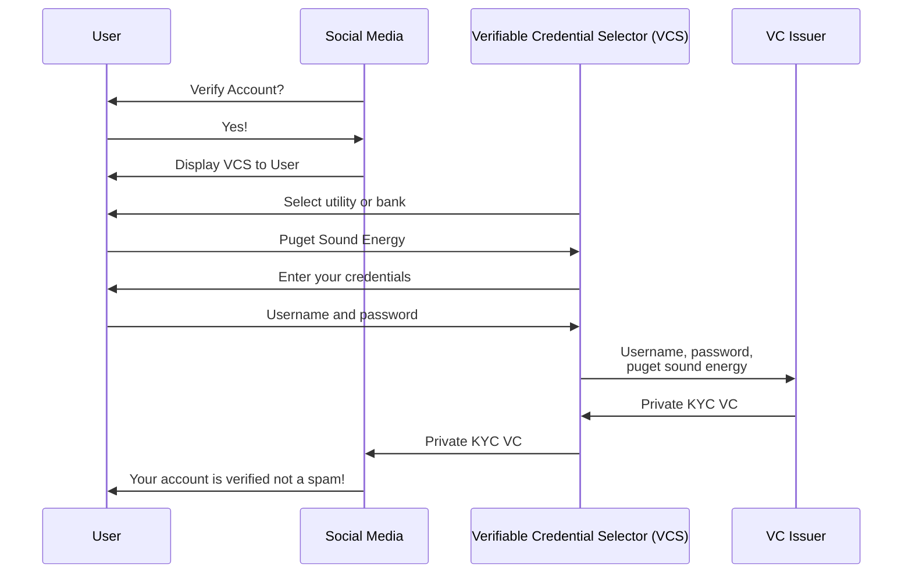
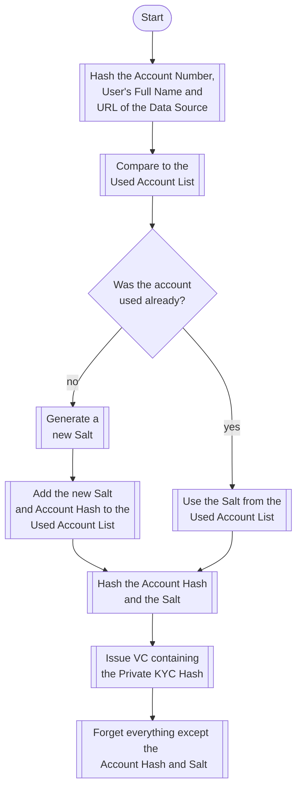
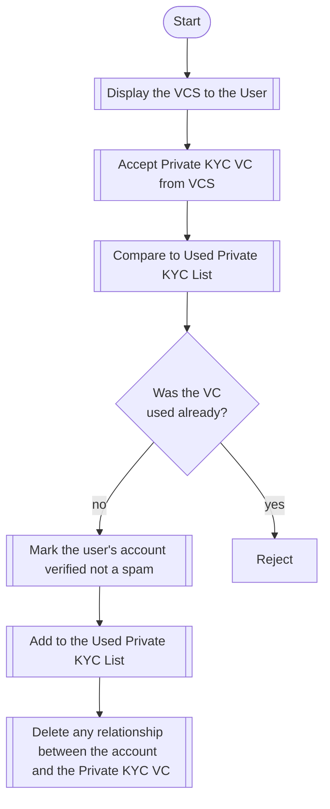

# Using Verifiable Credentials to Kill Spam and Preserve Privacy on Social Media

Verifiable Credentials (VCs) (include link) are one of the main building blocks of Web5 (include link) and help solve longstanding problems
with spam accounts on social media.

## Overview of anti-spam solutions
A good anti-spam solution is easy for real people and costly for spammers. In fact the entire point of anti-spam
measures is to create a cost to the spammers that is so expensive their business is no longer profitable, 
while not being so annoying to users that they decide not to use the service.

### Account Bonds
In this solution people are asked to deposits $10 of bitcoin at account creation time. If the account later engages in posting spam 
the account is deactivated and the funds are collected by the social media platform as payment. 
This would eliminate all spam accounts that fail to earn at least $10 before being identified and disabled. 

This works well for users that can afford to lockup $10 for many months or years and 
can easily obtain $10 in bitcoin through a bitcoin exchange or peer to peer marketplace.
$10 is also costly enough to eliminate the vast majority of spam accounts.

### Message Bonds
Here users post a small bond with every message they post
($0.10 worth of bitcoin). 
If the user engages in spam or other unwanted messages the messages are deleted by moderators and 
instead of banning the account entirely (as is the case with Account Bonds) the small amount 
associated with each deleted message is deducted from their account.

This is roughly as costly to spam accounts as the Bitcoin Bond solution and
works well for the same subset of users and might work better to proportionally punish users
that only occasionally violate the terms of service instead of disabling their entire account
for a single infraction.

### One-time Credit Card Payment
A single up front credit card payment can be effective at increasing the cost for creating a spam account,
but it excludes users that don't want to share their real world identity with the social media site
and users that don't have access to credit cards accepted in the country the site is operated within. 

As with deposits made with Bitcoin it also excludes people unwilling to lockup $10 before even trying
a social media site.
 
### Recurring Credit Card Payments
Small recurring credit card payments do an excellent job at making spam costly - especially on social media sites
where the older the account is the more followers it has and the more often it's messages are read.
This is because every month the account is alive there is an increasing investment made by the user
and when the account is disabled all of the monthly payments made so far are lost.

This is a good solution for people that plan to use their real world identities on the social media site,
are happy to pay a monthly fee for access to the site and don't mind the privacy implications of a social media
site keeping their current credit card information on file.

## Introducing Private KYC

Although the title of this section probably looks like an oxymoron it is actually not only possible to use traditional KYC to prevent
spam, but with the magic of Verifiable Credentials to it in a privacy preserving way.
Although this method does not work best for all users, verifying a social media account using KYC data,
is more effective at punishing spammers than any other method and offers the fastest and cheapest method
for users that already have a bank account or pay for a phone, electricity, or water bill online.

Normal users can provide their username and password to a VC Issuer, something they have probably already done
when signing up for a bitcoin exchange or a peer to peer payments application like Cash App or Venmo,
and get a digital document (a Verifiable Credential) that 
proves they have a financial or utility account. 
In order for a spammer to obtain one of these Verifiable Credentials
they would need to use one of the limited number of utility or bank accounts they have access to use
and once the few social media accounts they use are identified and disabled they will 
not be able to to obtain more at low cost.

Because the data shared only contains a one-way hash of the account information the social media company does not know
the identity of the user (unlike with credit card payments), but they do know that the person used an account
for verification that is costly to obtain and requires strong identity verification.	 

And because the VC Issuer is contractually obligated to erase everything except a hash of the account (to prevent issuing 
duplicate verification data) the users privacy is preserved.

This is an overview of the process for obtaining and using a Private KYC VC.

## Comparing Private KYC
With Private KYC nothing is stored by either the social media company or the VC Issuer that verified the users account credentials with their bank or utility.
Users don't incur a financial cost and the only hassle involved is logging into their financial account. If the account is used to post spam
it will be disabled and the same financial account can't be used again to create another social media account on the same site.

This works well for people that have access to any bank account, utility account, credit card account, payments app or any other account that required 
strong identity verification. 

| Solution 				| Privacy 	| User Hassle 	| User Cost 	| Accessible By					| Effectiveness |
| ------------------------------------- | ------------- | ------------- | ------------- | --------------------------------------------- | ------------- |
| Private KYC Verifiable Credential	| Very Good 	| Very Low 	| free 		| Someone that has a bank or utility account 	| Very Good	|
| Account Bonds				| Very Good 	| Very Low 	| $10 refundable| Someone with a Lightning Bitcoin Wallet 	| Good		|
| Message Bonds				| Very Good 	| Very Low 	| $10 refundable| Someone with a Lightning Bitcoin Wallet 	| Good		|
| Recurring Credit Card Payments 	| Bad 		| Bad 		| $10 per month | Someone with a credit card 			| Very Good 	|
| One-time Credit Card Payment 		| Bad 		| Bad 		| $10 once 	| Someone with a credit card 			| Good		|

## Private KYC Technical Details
When the user is asked to verify their account the social media site presents the Verifiable Credential Selector
that allows them to select their bank account, utility bill or other financial app or service.
Based on the selection the VC Issuer (currently either MX or Sophtron) is selected
and the user provides their login credentials to the VC Issuer in order to retrieve
their account number and full name.

The VC Issuer then creates a hash of the account number and name called the Account Hash
and checks to see if it matches the list of Account Hashes 
in order to see if it has already issued a Private KYC VC for this account.

If it has already issued a Private KYC VC for this account it uses the same Salt
it generated previously so that the VC will contain the identical hash.
This ensures that the user can only obtain a single VC for each of their accounts.

If this account has not previously been used to generate a VC a new Salt (random number)
is generated and saved with the Account Hash so it can be used with future requests.

Next the VC Issuer Hashes the Account Hash and the Salt to create the Private KYC Hash.
The Salt is included so that even if a malicious actor obtained a list
of all account numbers and names and had a mapping between all social media accounts
and the Private KYC VC used to verify them he would not be able to match them
without also obtaining the matching Salt.

After giving the user (or the social media platform) a copy of the Private KYC VC
(that only contains the Private KYC Hash and the signature of the VC Issuer and nothing else)
the VC Issuer deletes all credentials and any other data it obtained in the process
with the sole exception of the Account Hash and the Salt. 

### How the Private KYC VC is Issued
This flowchart provides an overview of how the Private KYC is issued by the VC issuer after it is provided the
credentials needed directly from the user.

When a user asks to verify their social media account the social media app presents the user with the Verifiable 
Credential Selector. Credentials and other sensitive information is sent directly between the end user and
the VC Issuer so that the social media site is never in possession of any sensitive data.

Once the VC Issuer has issued the Private KYC VC that is shared with the social media company,
but it does not contain anything expect a one-way hash that can't be used to read 
any data and can't even be used to compare data without also obtaining the Salt
that is not shared with the social media company.

The social media company then compares the VC with the list it maintains of previously used VCs.
This list is not tied to any social media account and is only maintained to ensure that a given
VC is only used to verify a single account (not what account it verified).

If the VC was previously used the verification request is rejected, but if it has not been previously used
the VC is added to the list of used VCs and the social media account is marked verified.

At this point the social media company should take special care to ensure it does not keep a record of the VC
used to verify a given account. This ensures that even if all three services suffer a data breach it would 
be impossible to map the real world identity to the social media account used.

For example assume the user used Sophtron as the VC Issuer and selected Boeing Employees Credit Union
as the data source in requesting a verified account.
If a malicious actor obtained the users account number and full name from Boeing Employees Credit Union
he would not be able to match it to the users Verifiable Credential without also obtaining the Salt
stored by MX. And as long as the social media company does not go out of their way to violate
best practices (and contractual obligations) by recording a mapping between the social media account
and the VC used to verify it, the malicious actor would not be able to obtain any additional information
(except that the user did have a verified account at some point on the social media platform). 

## How the Social Media Company Uses the Private KYC Verifiable Credential
This flowchart provides an overview of how the social media company interacts with the user
and processes the VC issued by the VC Issuer.

## Conclusion

Private KYC is a good option to verify users are not spammers that has the lowest cost, least hassle and 
best preserves user privacy for a large subset of potential users. 

The Verifiable Credential Selector (VCS) Block Incubation Project is an open source widget
that makes it easy for a social media sites (or other applications) to integrate with a VC Issuer
that allow users to obtain Private KYC VCs.

For more information on Private KYC and the VCS please reach out on our Forum, or Discord, or open an issue on GitHub.

