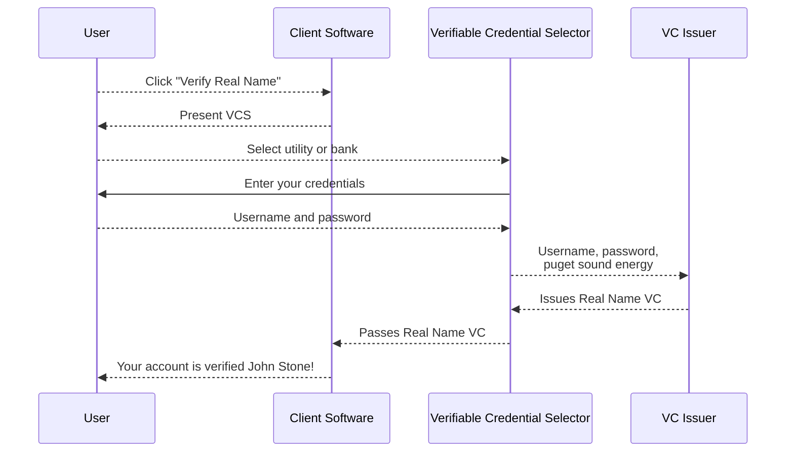
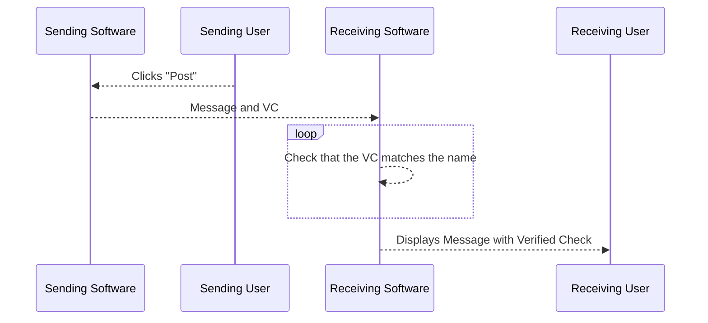

# Using Real Name Verifiable Credentials to Verify Decentralied Social Media Accounts

In the blog Using Real Name Verifiable Credentials to Verify Social Media Accounts (include link) we assumed the social media company was a centralized entity VC (by tracking when a VC has been used). In this blog we will assume that a decentralized social media network is used. This means that verifying your real name is not possible at all by submitting documents to the social media company for review because there is no social media company involved. Fortunately Real Name Verifiable Credentials work equally as well in both centralized and decentralized systems.

The purpose of the Real Name VC remains the same in centralized and decentralized systems - to prove that your screen name is your real name. In both types of systems some users want the option to be provide evidence that they are using their real name and not a psudonymous screen name. The ability to post psudonymously and with your real name are both important features of popular social media services such as Twitter and Verifiable Credentals and the VCS can provide the same functionality to services such as bluesky and nostr and even email or IRC.

To accomplish this decentralized social media networks can leverage Blocks open source incubation project called the [Verifiable Credential Selector](https://developer.tbd.website/blog/announcing-web5-verifiable-credential-selector) 
to allow users to prove their real name using services such as their bank account
or a utility service without providing anything else about themselves.

One way to make this work with a decentralized social media network the client (the software users install to interact with the nework) needs to include a button to "verify your real name" that opens up the VCS widget and allows users to retrieve a Real Name VC. After that the client can transmit the VC (only a few bytes of data) with messages so that other clients can verify that the VC was issued by a trustworthy source and that it contains the name and public key (or other user ID) that matches the name used with the message. Users reading messages or posts that include the VC could then be shown a "verified" check mark by the senders displayed name.  

This is an overview of the process for obtaining and a Real Name VC in a decentralized social media network.

This is an overview of how the Real Name VC is used by message recipients (or readers of a post) in a decentralized social media network after the sender has obtained a Real Name VC.

## Conclusion
Using Blocks Verifiable Credential Selector open source incubation project decentralized messaging services, including decentralized social media networks)
can include the "verified" check feature.

## A Couple Words of Caution
While this does prevent most impersonation it is still possible to impersonate someone that has the same legal name. For example if someone else has the legal name Elon Musk he can open bank accounts are utility accounts with that name and obtain a Real Name VC that proves his real name is Elon Musk. While it is true that this is his real name readers of posts could be decieved into thinking that they are reading posts from the CEO of Tesla when are not. To fix this "name collision" impersonation probably requires some level of manual verification on the part of the VC issuer, but this could be an opportunity for a paid teir of verification where the VC contains additional information such as "the celebrity known as Elon Musk."

In order for a third party to certify someone's real name they must obtain sensitive data about that person. One of the goals of the VCS open source project is to only include reputable data providers and to make sure that the privacy policies of the included providers are clearly communicated to companies and open source projects and that the privacy policies are presented to end users so that it easy for them to make informed decisions. Downstream users of the VCS should also participate in this evaluation process.

