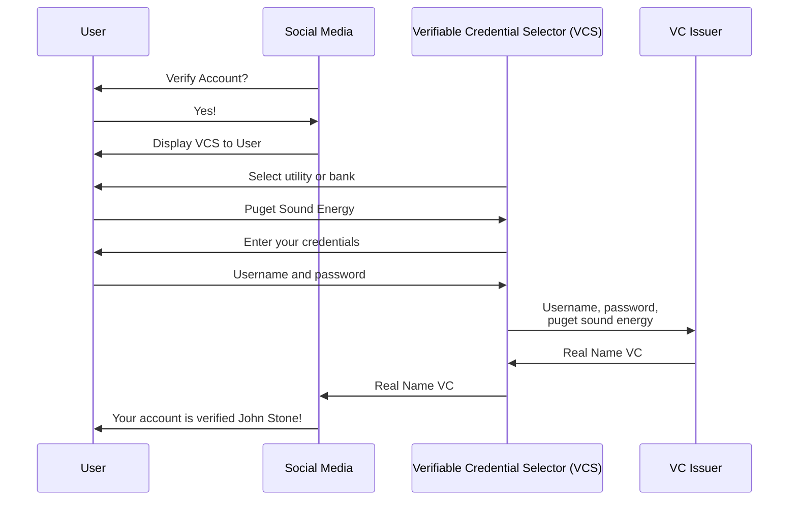

# Using Real Name Verifiable Credentials to Verify Social Media Accounts
While some users want to use screen names to preserve their privacy others want their audience to be able to easily confirm that
they are using their real names. This is especially important for public figures such as business leaders and politicians.

Most often this involves a tedious and error prone process of manually reviewing documents such
as drivers licenses and birth certificates and often this process can be easily gamed with
the Photoshop skills of a middle school student.

Not only is the process expensive for the social media site, but it makes on boarding
some of the most valuable users of a social media site much more annoying and requires users to wait days or weeks
if they want to post with a verified account.

Fortunately social media sites can now leverage Blocks open source incubation project called the [Verifiable Credential Selector](https://developer.tbd.website/blog/announcing-web5-verifiable-credential-selector) 
to allow users to prove their real name using services such as their bank account
or a utility service without providing anything else about themselves.

For example a user can prove that their name is "John Stone" according to one of 40,000 services that
without ever knowing what the service is or anything more about John Stone
than his real name.

This can all be completed within about 30 seconds and the cost to the social media company 
(although it varies slightly across the available data providers)
is less than a penny per verified account.

This is an overview of the process for obtaining and using a Real Name VC.

## Real Name Verifiable Credential Technical Details
When a user chooses to verify their screen name matches their real name the social media site presents
the Verifiable Credential Selector (VCS). 
This allows the user to select their bank account or utility account from the list of supported 
data sources and provide their username and password to that service.

The VC Issuer then retrieves the users name from the service and issues a Verifiable Credential
that contains only the name of the account holder on the account.
The name of the bank or utility account is not included.

Real Name VC Issuers will only use data sources that are trustworthy. For example 
services that perform in-person KYC such as banks and utility companies
can be leveraged to determine a users real name by leveraging the identity 
verification that user has had to perform previously to open a bank account
or to sign up for a water bill.

The only data that is included in the VC is the name of the account holder
and the signature of the VC Issuer that obtained the name
and issued the Verifiable Credential.

The user then presents this VC to the social media site as strong proof
of their real name. If the name matches their existing screen name
the social media site marks the account verified.

The VC does not contain anything about the user that they don't want to have published
(it only contains their name) so the social media site can keep the VC
or they can discard it.

## Conclusion
Using Blocks Verifiable Credential Selector open source incubation project social media sites
can obtain strong evidence of a users real name in near real time,
in a way that is fully automated, and far more cheaply than manual document review.

