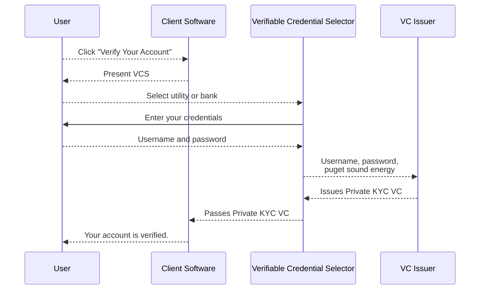
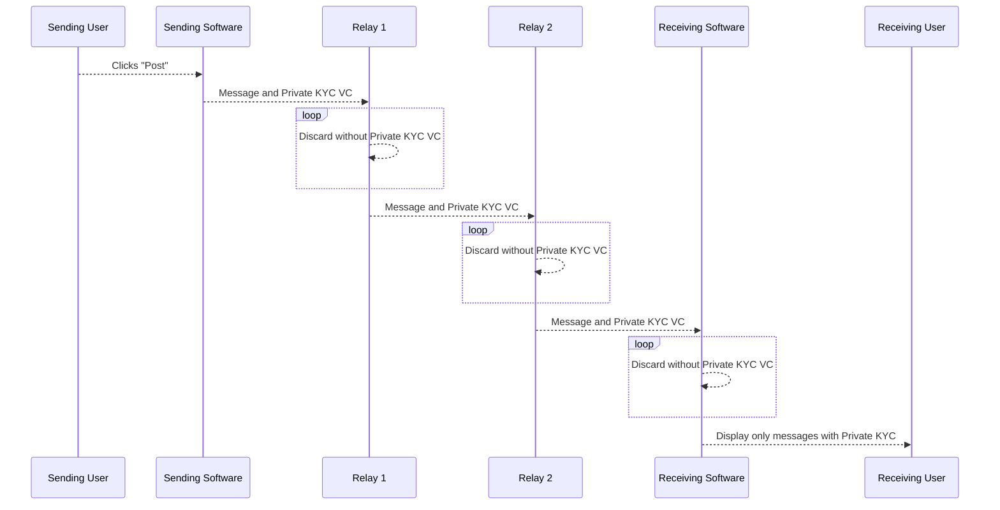
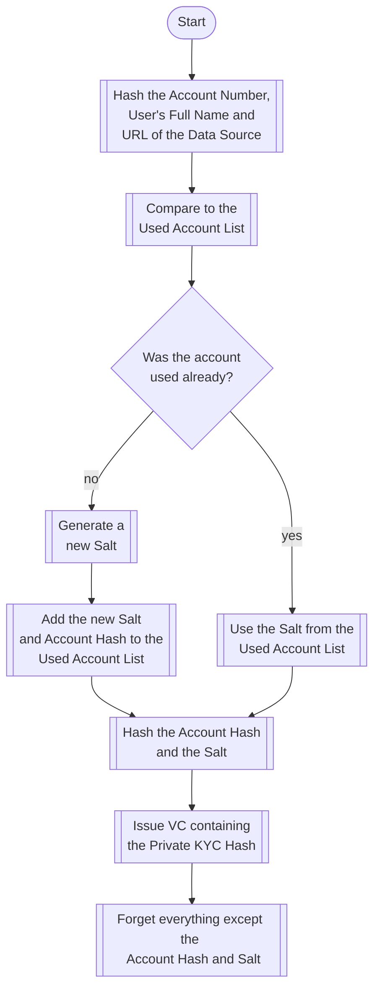
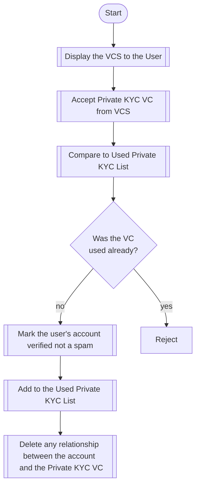

# Using Verifiable Credentials to Kill Spam and Preserve Privacy on Social Media

In the blog Using Verifiable Credentials to Kill Spam and Preserve Privacy on Social Media (include link) we explained how the Private KYC Verifiable Credential could be used to verify social media accounts are not spammers or malicious bots. The basic idea is that if someone proves that they have an online account that has a significant cost to create (such as a bank account or utility account) that account can't be used to engage in spam because it can be banned and the spammer will not easily obtain another one.

This same system can be used with decentralized social media, but we don't have a central service to perform some of the steps outlined in that blog so a few changes are required. 

If you have not already read Using Verifiable Credentials to Kill Spam and Preserve Privacy it might be a good idea to do that before continuing.

The biggest difference when using the Private KYC VC in a decentralized network is that you must associate your VC with your social media name for everyone to see. When a centralized service is used that service can verify an account, remember that the VC was used already, but forget that the VC was used for a particular account. This provides the assurance that the only way to associate the real name of the person with the Private KYC verified account is for the social media company to proactively retain data that it should not (and should be obligated to destroy in it's TOS) and for the utility or bank to be compromised and for the VC Issuer to be compromised.

With a decentralized social media (or messaging) service the Private KYC VC must be included in every message sent so the VC will be directly associated with the social media user. Fortunately the Private KYC VC only contains a one-way hash of the data obtained from the bank or utility account with a randomly generated nonce. This means that even with possession of the Private KYC VC it is not possible to determine anything about the without first obtaining access to the utility or bank account and also compromising the systems of the VC Issuer to obtain the nonce (something that the VC Issuer should never share). In other word unless the VC Issuer and the bank account of the user is hacked it won't be possible to match the social media account with the individual 

----- going to make a copy and see if I can improve this security risk

but that stillrequires that both the VC Issuer and the utility or bank account used is compromised before the social media account can be tied back to the users identity. So while this is not quite as strong, it still requires a lot to go wrong in two distinct companies before a users privacy is damaged. And in order to have a massive breach that exposes the real names of all users thousands of banks, credit unions and utility companies would first need to be breached. This is because the Private KYC VC still only contains a one-way hash of a random nonce and the identity information obtained by the VC Issuer from the utility or bank. This makes Private KYC VCs a viable alternative to the other methods for controlling spam while supporting pseudonymous accounts on decentralized social media.

This is an overview of the process for obtaining a Private KYC VC with a decentralized social network.

Once the user has obtained a Private KYC VC all messages sent will attach this VC (about a kilobyte of data). Decentralized systems we have looked at have two places where this VC can be used. The first is at the receiving client software. Here the software can either deprioritize unverified senders, place messages from unverified senders under a "show more" button or discard them entirely based on user preference and the amount of spam in the system. 

The other location where Private VCs can be used is on the relay servers. If spam is a significant enough problem relay servers could immediately discard messages that do not contain a Private KYC VC or another form of spam prevention such as a micro-payment.

A good spam prevention system makes it as easy as possible for end users while maximizing the cost of unwanted messages so it makes sense to forward messages that contain micropayments or that contain Private KYC VCs.

This diagram shows how Private KYC VCs can be used in both locations on the decentralized messaging network: 

## Conclusion

Private KYC is a good option to verify users are not spammers that has the lowest cost, least hassle and 
best preserves user privacy for a large subset of potential users. 

The Verifiable Credential Selector (VCS) Block Incubation Project is an open source widget
that makes it easy for a decentralized social media projects (or other applications) to integrate with a VC Issuer
that allow users to obtain Private KYC VCs.

For more information on Private KYC and the VCS please reach out on our Forum, or Discord, or open an issue on GitHub.

##### Design accomplishments of Private KYC
- Unless these violations occur the social media account can't be tied back to the person's identity.
	- The social media company plans ahead to be malicous and stores the VC associated with the account.
	- A bad guy gets access to the social media company data.
	- A bad guy gets access to the bank used to verify the account.
	- A bad guy gets access to the VC Issuer data.

##### Design accomplishments of Decentralized Private KYC 1.0
- Unless 
	- The VC Issuer plans ahead to be malicous and stores the person's name the VC it issued
		- It has the VC associated with the account because that is public.
		- It has the Social Hash, but that lacks the Salt so it can't be used to match to the VC.
		- It does not store the Salt (that is forgotten immediately).
		- It does have the date and time that it issued a through the Social Hash if it is provided
			the account info again. Would be nice to do this in a less specific way so that
			the VC Issuer data can't be used for timing attacks to deterimen the likely accounts
			that were created by the account info.
		-  
	- bank account used to verify the account
	- VC Issuer Data 

## Decentralized Private KYC Technical Details
When the user is asked to verify their account the client software presents the Verifiable Credential Selector
that allows them to select their bank account, utility bill or other financial app or service.
Based on the selection the VC Issuer (currently either MX or Sophtron) is selected
and the user provides their login credentials to the VC Issuer in order to retrieve
their account number and full name.

The VC Issuer then creates a hash of the account number and the name on the account and the name of the social media network
that that the VC will be used with. This is called the Social Hash.

If the Social Hash was used twice in (approximately) the last 12 months the VC Issuer will deny the request.
This ensures that a single account can't be used to generate enough of unique Decentralized Private KYC VCs to
make it practical to use for spam.

The VC Issuer then combines a random number 
(called a salt), the account name, account number and social media network name to generate a hash
that we call the Decentralized Private KYC Hash. 

Next the VC Issuer creates the Decentralized Private KYC VC that includes only the the Decentralized Private KYC Hash 
and ruturns it to the VCS that passes it along to the Software Client used to access social media network.

Then the VC Issuer records the date that he issued a VC and the Decentralized Private KYC Hash used. To make it more
difficult to correlate the Private KYC VC issued with the Decentralized Private KYC Hash (that could be correlated to the person
if their bank account or utility data was hacked) the date used is randomly selected from up to 6 months prior and up to 6 months in the future.
This means that if someone needs to request a new Private KYC VC using the same account they will be able to request their third anywhere between 6 and 18 months after their first.

Finally the VC Issuer then deletes all records associated with this user except the Social Hash and the randomized date
when it was used.

At this point the VC Issuer does not know anything about the user that could be used to match the Decentralized Private KYC VC with the person because the salt used to generate the Social Hash has been deleted. In order to correlate the person to the Decentralized Private KYC VC the following conditions would need to be met:

- The VC Issuer kept a copy of the salt that they are contractually obligated to permanently delete when they issued the VC.
- The 

### How the Private KYC VC is Issued
This flowchart provides an overview of how the Private KYC is issued by the VC issuer after it is provided the
credentials needed directly from the user.

When a user asks to verify their social media account the social media app presents the user with the Verifiable 
Credential Selector. Credentials and other sensitive information is sent directly between the end user and
the VC Issuer so that the social media site is never in possession of any sensitive data.

Once the VC Issuer has issued the Private KYC VC that is shared with the social media company,
but it does not contain anything expect a one-way hash that can't be used to read 
any data and can't even be used to compare data without also obtaining the Salt
that is not shared with the social media company.

The social media company then compares the VC with the list it maintains of previously used VCs.
This list is not tied to any social media account and is only maintained to ensure that a given
VC is only used to verify a single account (not what account it verified).

If the VC was previously used the verification request is rejected, but if it has not been previously used
the VC is added to the list of used VCs and the social media account is marked verified.

At this point the social media company should take special care to ensure it does not keep a record of the VC
used to verify a given account. This ensures that even if all three services suffer a data breach it would 
be impossible to map the real world identity to the social media account used.

For example assume the user used Sophtron as the VC Issuer and selected Boeing Employees Credit Union
as the data source in requesting a verified account.
If a malicious actor obtained the users account number and full name from Boeing Employees Credit Union
he would not be able to match it to the users Verifiable Credential without also obtaining the Salt
stored by MX. And as long as the social media company does not go out of their way to violate
best practices (and contractual obligations) by recording a mapping between the social media account
and the VC used to verify it, the malicious actor would not be able to obtain any additional information
(except that the user did have a verified account at some point on the social media platform). 

## How the Social Media Company Uses the Private KYC Verifiable Credential
This flowchart provides an overview of how the social media company interacts with the user
and processes the VC issued by the VC Issuer.

