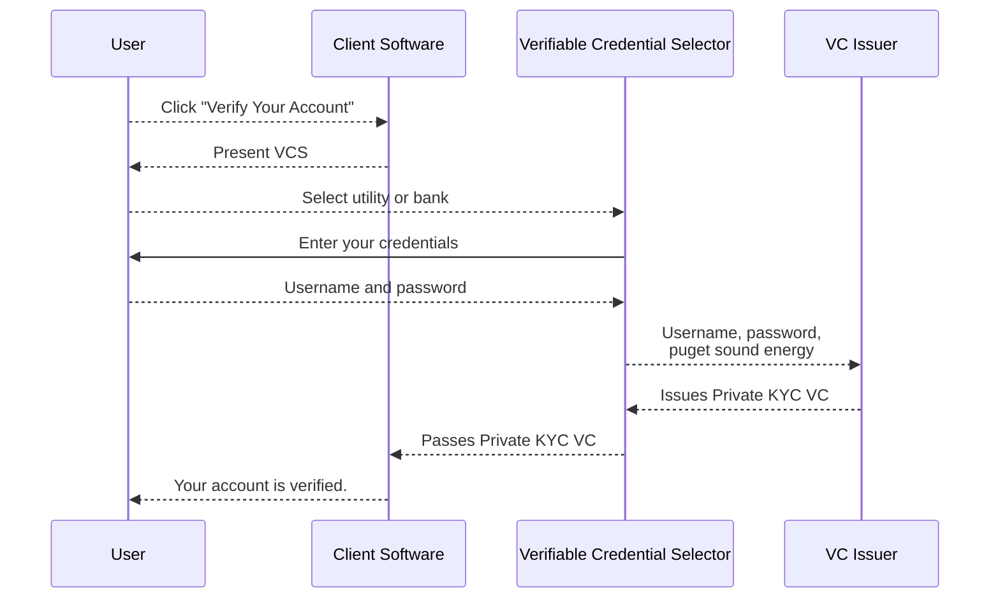
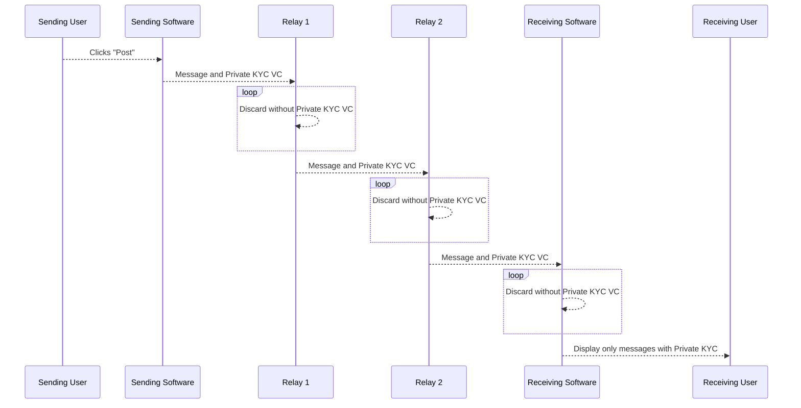

# Using Verifiable Credentials to Kill Spam and Preserve Privacy on Social Media

In the blog Using Verifiable Credentials to Kill Spam and Preserve Privacy on Social Media (include link) we explained how the Private KYC Verifiable Credential could be used to verify social media accounts are not spammers or malicious bots. The basic idea is that if someone proves that they have an online account that has a significant cost to create (such as a bank account or utility account) that account can't be used to engage in spam because it can be banned and the spammer will not easily obtain another one.

This same system can be used with decentralized social media, but we don't have a central service to perform some of the steps outlined in that blog so a few changes are required. 

If you have not already read Using Verifiable Credentials to Kill Spam and Preserve Privacy it might be a good idea to do that before continuing.

The biggest difference when using the Private KYC VC in a decentralized network is that you must associate your VC with your social media name for everyone to see. When a centralized service is used that service can verify an account, remember that the VC was used already, but forget that the VC was used for a particular account. This provides the assurance that the only way to associate the real name of the person with the Private KYC verified account is for the social media company to proactively retain data that it should not (and should be obligated to destroy in it's TOS) and for the utility or bank to be compromised and for the VC Issuer to be compromised.

With a decentralized social media (or messaging) service the Private KYC VC must be included in every message sent so the VC will be directly associated with the social media user. Fortunately the Private KYC VC only contains a one-way hash of the data obtained from the bank or utility account with a randomly generated nonce. This means that even with possession of the Private KYC VC it is not possible to determine anything about the without first obtaining access to the utility or bank account and also compromising the systems of the VC Issuer to obtain the nonce (something that the VC Issuer should never share). In other word unless the VC Issuer and the bank account of the user is hacked it won't be possible to match the social media account with the individual 

----- going to make a copy and see if I can improve this security risk

but that stillrequires that both the VC Issuer and the utility or bank account used is compromised before the social media account can be tied back to the users identity. So while this is not quite as strong, it still requires a lot to go wrong in two distinct companies before a users privacy is damaged. And in order to have a massive breach that exposes the real names of all users thousands of banks, credit unions and utility companies would first need to be breached. This is because the Private KYC VC still only contains a one-way hash of a random nonce and the identity information obtained by the VC Issuer from the utility or bank. This makes Private KYC VCs a viable alternative to the other methods for controlling spam while supporting pseudonymous accounts on decentralized social media.

This is an overview of the process for obtaining a Private KYC VC with a decentralized social network.

Once the user has obtained a Private KYC VC all messages sent will attach this VC (about a kilobyte of data). Decentralized systems we have looked at have two places where this VC can be used. The first is at the receiving client software. Here the software can either deprioritize unverified senders, place messages from unverified senders under a "show more" button or discard them entirely based on user preference and the amount of spam in the system. 

The other location where Private VCs can be used is on the relay servers. If spam is a significant enough problem relay servers could immediately discard messages that do not contain a Private KYC VC or another form of spam prevention such as a micro-payment.

A good spam prevention system makes it as easy as possible for end users while maximizing the cost of unwanted messages so it makes sense to forward messages that contain micropayments or that contain Private KYC VCs.

This diagram shows how Private KYC VCs can be used in both locations on the decentralized messaging network: 

## Conclusion

Private KYC is a good option to verify users are not spammers that has the lowest cost, least hassle and 
best preserves user privacy for a large subset of potential users. 

The Verifiable Credential Selector (VCS) Block Incubation Project is an open source widget
that makes it easy for a decentralized social media projects (or other applications) to integrate with a VC Issuer
that allow users to obtain Private KYC VCs.

For more information on Private KYC and the VCS please reach out on our Forum, or Discord, or open an issue on GitHub.

